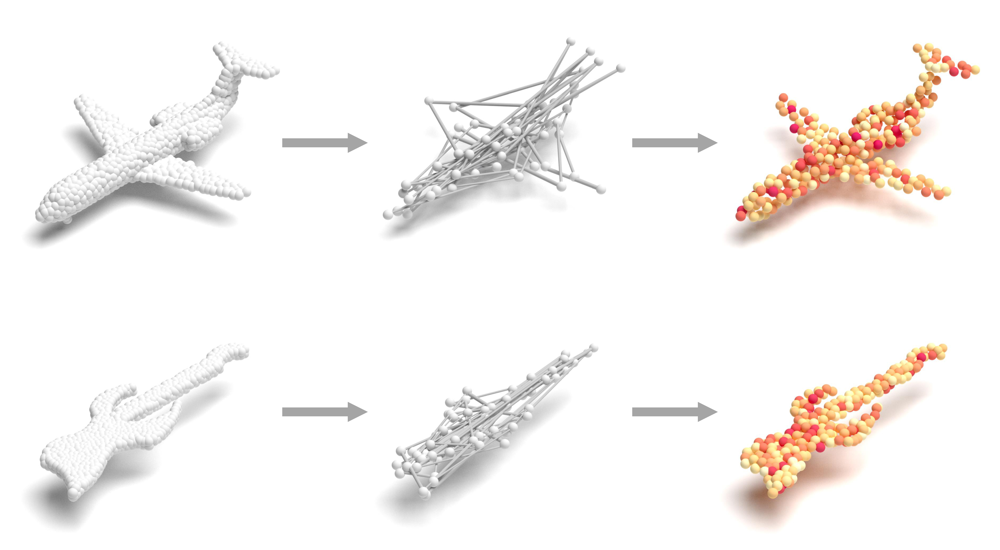

# PointSCNet: Point Cloud Structure and Correlation Learning based on Space Filling Curve guided Sampling


## Description
This repository contains the code for our paper: [PointSCNet: Point Cloud Structure and Correlation Learning based on Space Filling Curve guided Sampling](https://doi.org/10.3390/sym14010008)

<div align="center">
<br><br>
</div>

 
## Environment setup

Current Code is tested on ubuntu18.04 with cuda11, python3.6.9, torch 1.10.0 and torchvision 0.11.3. 
We use a [pytorch version of pointnet++](https://github.com/yanx27/Pointnet_Pointnet2_pytorch) in our pipeline.


## Classification (ModelNet10/40)
### Data Preparation
Download alignment **ModelNet** [here](https://shapenet.cs.stanford.edu/media/modelnet40_normal_resampled.zip) and save in `data/modelnet40_normal_resampled/`.

### Data Preparation


### Run

```
python train.py --model SCNet --log_dir SCNet_log --use_normals --process_data
```

* --model: model name
* --log_dir: path to log dir
* --use_normals: use normals
* --process_data: save data offline

## Test

```
python test.py --log_dir SCNet_log --use_normals
```


### Performance
| Model | Accuracy |
|--|--|
| PointNet (Official) |  89.2|
| PointNet2 (Official) | 91.9 |
| PointSCNet |  **93.7**|


## Citation
Please cite our paper if you find it useful in your research:

```
@article{chen2022pointscnet,
  title={PointSCNet: Point Cloud Structure and Correlation Learning Based on Space-Filling Curve-Guided Sampling},
  author={Chen, Xingye and Wu, Yiqi and Xu, Wenjie and Li, Jin and Dong, Huaiyi and Chen, Yilin},
  journal={Symmetry},
  volume={14},
  number={1},
  pages={8},
  year={2022},
  publisher={Multidisciplinary Digital Publishing Institute}
}
```

## Contact
If you have any questions, please contact cxy@cug.edu.cn
